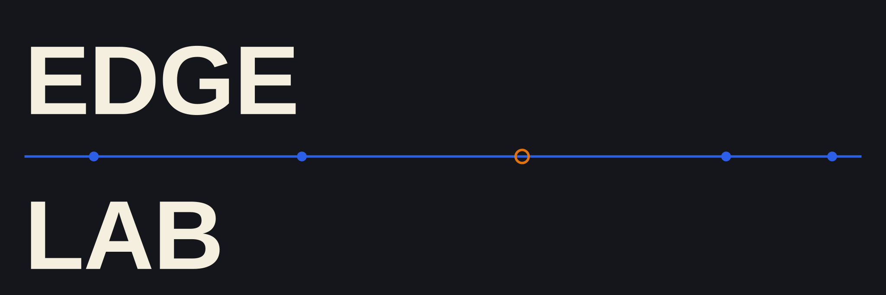

<p align="center">
  
  
  
  
</p>

**Quatro microprojetos independentes sobre o caminho de uma requisição de conteúdo,
da origem até a borda.**

O EdgeLab reproduz, em ambiente controlado, problemas que aparecem em plataformas de
distribuição de conteúdo: memória sob concorrência, cache que precisa respeitar
autorização, um destino que continua respondendo `200` enquanto degrada, e uma
plataforma que só é operável se cada mecanismo de segurança e recuperação for
testado, não apenas declarado.

[Catálogo](#catálogo-dos-projetos) ·
[Rotas de estudo](#rotas-de-estudo) ·
[Resultados medidos](#resultados-medidos) ·
[Como executar](#como-executar)

> [!NOTE]
> A coleção está concluída em P04 e não receberá novos microprojetos. Futuras
> mudanças ficam restritas a correções, manutenção de dependências e atualização de
> evidências que deixarem de ser reproduzíveis.

## A ideia em uma imagem

```text
requisição de conteúdo
       |
       v
origem (o recurso caro)
       |
       v
borda com cache e autorização
       |
       v
degradação sem queda (health check cego)
       |
       v
plataforma que prova, e não só declara, sua recuperação
```

O repositório não forma uma aplicação única. Cada projeto tem seu próprio módulo Go,
Dockerfile, testes e evidência. Essa separação permite abrir qualquer pasta, entender
uma decisão e reproduzir o experimento sem carregar os demais projetos.

## O que existe aqui

- **4 projetos concluídos**, de P01 a P04.
- **Go 1.26** em todos os módulos.
- **Uma pergunta principal por projeto.**
- **Uma falha reproduzível**, não apenas um caminho feliz.
- **Testes e evidências locais** ligados ao cenário executado.
- **Zero código compartilhado** entre projetos independentes.
- **Um `PASSO-A-PASSO.md`** por projeto, com a execução guiada comando a comando.

## Mapa da coleção

```text
P01  A origem: memória versus fluxo sob concorrência
 |
 +-- P02  A borda: cache compartilhado com autorização por requisição
 |
 +-- P03  A rota: decidir para onde mandar tráfego quando um destino degrada
 |
 +-- P04  A plataforma: provar que probes, HPA, NetworkPolicy e rollout funcionam
```

A ordem segue a profundidade do caminho de uma requisição: primeiro o servidor que
guarda o conteúdo, depois o cache que o distribui, depois o roteador que escolhe o
destino, depois o cluster que precisa operar tudo isso com segurança.

## Catálogo dos projetos

| Projeto | Conceitos visíveis | Pergunta principal | Prova reproduzida |
| --- | --- | --- | --- |
| [P01 · Hot path HTTP](./P01-hot-path-http/README.md) | `http.ServeContent`, buffer versus stream, carga concorrente | por que carregar um arquivo inteiro na memória e enviá-lo em fluxo se comportam tão diferente sob concorrência? | 64 clientes pedindo 16 MiB cada: o p99 do `streamed` ficou 1,8× melhor que o do `buffered` |
| [P02 · CDN com cache e URL assinada](./P02-cdn-signed-cache/README.md) | Nginx, `proxy_cache_lock`, HMAC, `auth_request` | como guardar uma cópia compartilhada de um arquivo sem entregá-la a quem não tem direito a ela? | 98% de alívio na origem com 100% das requisições autorizadas individualmente |
| [P03 · Roteamento sob congestionamento](./P03-roteamento-sob-congestionamento/README.md) | Toxiproxy, health check, política adaptativa, Vegeta | o que o roteador deveria fazer com um destino que responde `200` mas está lento? | rodízio simples: p99 de 6,9ms para 806ms e 37% de erro; política adaptativa: p99 em 6,8ms e zero erro |
| [P04 · Plataforma operável em Kubernetes](./P04-plataforma-operavel-em-kubernetes/README.md) | Terraform, Helm, HPA, NetworkPolicy, Calico, Prometheus/Grafana | outra pessoa, sem ter escrito uma linha desse código, consegue implantar, observar, escalar e recuperar o serviço com segurança? | HPA reagiu de 2 para 8 réplicas em cerca de 136s sob rampa de 20 a 350 rps; rollout inválido ficou sem tráfego |

## Rotas de estudo

### Quero começar pelo fundamento de desempenho

```text
P01 -> P02
```

O P01 isola o efeito de memória e fluxo numa única rota. O P02 usa a mesma ideia de
servir conteúdo, mas adiciona a pergunta de quem tem direito a recebê-lo.

### Quero entender decisões de tráfego e roteamento

```text
P02 -> P03
```

O P02 mostra um cache que decide o que guardar. O P03 mostra um roteador que decide
para onde mandar, mesmo quando o sinal de saúde mente.

### Quero estudar operação e recuperação em produção

```text
P03 -> P04
```

O P03 prova que saudável no protocolo não é o mesmo que saudável na prática. O P04
leva essa mesma origem e essa mesma borda para dentro de um cluster Kubernetes e
testa se a plataforma reage de verdade a degradação, carga e rollout quebrado.

### Quero o caminho completo, do byte ao cluster

```text
P01 -> P02 -> P03 -> P04
```

## Resultados medidos

Estes números pertencem aos ambientes descritos nas evidências. Eles tornam o
comportamento visível, mas não formam um teste universal de desempenho nem
representam capacidade de produção.

| Projeto | Resultado observado |
| --- | --- |
| P01 | com 64 clientes concorrentes pedindo 16 MiB, o `streamed` entregou p99 de 106,85ms contra 196,26ms do `buffered`, cerca de 1,8× melhor |
| P02 | o cache absorveu 98% das requisições na origem; o `proxy_cache_lock` evitou o cache stampede sem mudar o hit ratio |
| P03 | um destino degradado (sem cair) levou o rodízio simples a 731 req/s com 37% de erro e p99 de 806ms; a política adaptativa sustentou 1200 req/s, sem erro, com p99 de 6,8ms |
| P04 | o HPA da origem escalou de 2 para 8 réplicas em cerca de 136s sob rampa de 20 a 350 rps; um rollout com readiness falsa ficou sem tráfego, confirmado em repetições |

Os arquivos dentro de `evidence/` guardam os resultados completos, requisições,
métricas e logs produzidos por cada laboratório.

## Tecnologias usadas

| Área | Ferramentas e conceitos |
| --- | --- |
| Linguagem e ambiente | Go 1.26, módulos independentes, Docker |
| HTTP e desempenho | `net/http`, `http.ServeContent`, carga concorrente, percentis |
| Borda e cache | Nginx, `proxy_cache`, `proxy_cache_lock`, HMAC, URL assinada |
| Rede e falha controlada | Toxiproxy, health check, retry, prazo por requisição |
| Geração de carga | Vegeta, modelo de tráfego aberto |
| Plataforma | Kubernetes (`kind`), Terraform, Helm, Calico, HPA, PDB, NetworkPolicy, RBAC |
| Observabilidade | Prometheus, Grafana, PromQL |

Uma ferramenta entra quando reproduz o mecanismo real usado em produção, não porque é
popular. A política continua visível no experimento e nos testes.

## Como executar

### Pré-requisitos

- Go `1.26`;
- Docker com Compose para P02, P03 e P04;
- um cluster `kind` e Terraform para P04.

Clone o repositório:

```bash
git clone https://github.com/matheusgb/edge-lab.git
cd edge-lab
```

Entre no projeto desejado. Cada pasta possui seu próprio `go.mod`:

```bash
cd P01-hot-path-http
go test ./...
go run ./cmd/...
```

Projetos com infraestrutura local mostram os comandos de Docker e Kubernetes no
próprio README e no `PASSO-A-PASSO.md`:

```bash
docker compose up -d --wait
go test ./...
docker compose down -v
```

Consulte o [catálogo](#catálogo-dos-projetos) para abrir as instruções específicas.

## Como explorar um projeto

Uma leitura curta costuma seguir esta ordem:

1. Abra o `README.md` e entenda a pergunta.
2. Siga o `PASSO-A-PASSO.md` se quiser rodar antes de ler o código.
3. Veja os testes que protegem a decisão principal.
4. Leia o fluxo central dentro de `internal/`.
5. Execute o experimento e compare a saída com o conteúdo de `evidence/`.
6. Altere uma premissa e observe onde a conclusão deixa de valer.

## Anatomia de uma pasta

```text
Pxx-conceitos-do-projeto/
├── README.md          explicação, execução, resultado e limite
├── PASSO-A-PASSO.md    execução guiada, comando a comando
├── go.mod / go.sum     dependências e versão do módulo
├── cmd/                pontos de entrada executáveis
├── internal/           implementação do mecanismo
├── test/               regra principal e falhas relevantes
└── evidence/           resultado observado
```

Não existe pacote `common`, estado compartilhado ou infraestrutura central. Um
projeto não precisa dos demais para funcionar.

## Limites da coleção

O EdgeLab comprova mecanismos em cenários pequenos e controlados, numa máquina e
numa região só. Ele não mede volume de produção, multi-região, custo de nuvem real
ou operação de um CDN comercial em escala.

A coleção termina em P04 e não receberá novos microprojetos. O repositório permanece
aberto para correções e manutenção do que já foi construído.

## Fim

O EdgeLab reúne quatro perguntas sobre entrega de conteúdo e transforma cada uma em
código pequeno, falha controlada e evidência reproduzível. Escolha um problema no
catálogo, entre na pasta e execute os comandos. O resultado mais útil não é decorar
uma ferramenta. É enxergar onde uma decisão de borda funciona, como ela degrada e até
onde a prova realmente vale.
