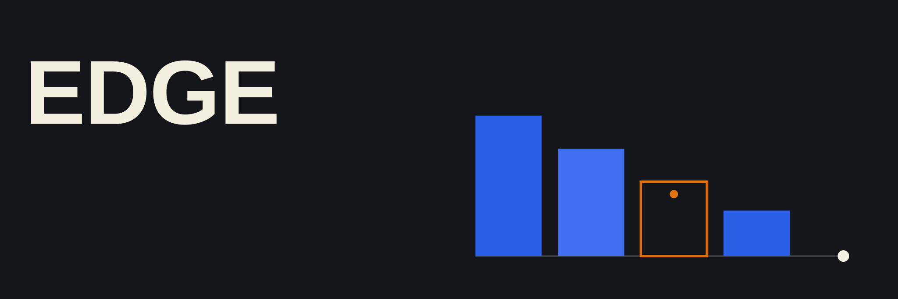

  
  
  
  

Cada projeto isola um problema real de plataformas de distribuição de conteúdo e
prova a resposta com teste e evidência, não só com código que compila. Cada pasta
tem módulo Go, testes e evidência próprios; abrir uma não exige carregar as outras.

## Projetos

- **[P01 · Hot path HTTP](./P01-hot-path-http/README.md)**. Serve o mesmo
  arquivo em memória inteira e em fluxo, e mede a diferença sob carga: com 64
  clientes concorrentes pedindo 16 MiB, o `streamed` leva 1,8× menos no p99.
- **[P02 · CDN com cache e URL assinada](./P02-cdn-signed-cache/README.md)**.
  Cache Nginx na frente da origem, com HMAC checando autorização requisição a
  requisição mesmo servindo de uma cópia compartilhada. 98% de alívio na origem,
  sem furar autorização nenhuma.
- **[P03 · Roteamento sob congestionamento](./P03-roteamento-sob-congestionamento/README.md)**.
  O roteador decide para onde mandar tráfego quando um destino responde `200`
  mas está lento. Rodízio simples chega a 37% de erro; política adaptativa zera
  o erro no mesmo cenário.
- **[P04 · Plataforma operável em Kubernetes](./P04-plataforma-operavel-em-kubernetes/README.md)**.
  A mesma origem e borda dentro de um cluster, com HPA, NetworkPolicy e rollout
  testados sob carga real, não só declarados no YAML.

A ordem segue a profundidade do caminho de uma requisição: origem, cache, roteador,
cluster. Cada `PASSO-A-PASSO.md` guia a execução comando a comando; os números
completos ficam em `evidence/`.

## Limites

O Edge comprova mecanismos em cenários pequenos e controlados, numa máquina e numa
região só. Não mede volume de produção, multi-região, custo de nuvem real ou
operação de um CDN comercial em escala.
